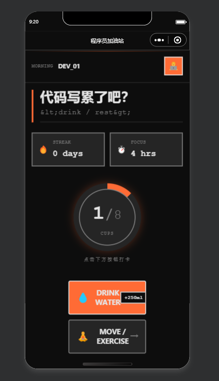

# 程序员加油站 - KeepAlive 小程序

## 项目简介

程序员加油站是一款专为程序员设计的健康提醒小程序，通过友好的界面和智能提醒功能，帮助用户保持良好的生活习惯。

## 项目预览



## 主要功能

### 1. 喝水打卡
- 实时记录每日喝水量
- 可视化进度展示
- 智能提醒功能
- 每日目标设定

### 2. 运动提醒
- 久坐提醒（默认60分钟）
- 提肛运动计时器
- 运动记录追踪
- 健康小贴士

### 3. 个人设置
- 微信一键登录
- 自定义工作时间
- 提醒设置（开关、间隔）
- 数据同步功能

## 技术特点

### 1. 设计风格
- 使用 Nord 配色方案，护眼舒适
- 现代化界面设计，符合小程序规范
- 响应式布局，适配不同屏幕尺寸

### 2. 技术架构
- 微信小程序原生开发
- 本地存储数据管理
- 动画效果增强用户体验
- 组件化架构，易于维护

### 3. 性能优化
- 高效的数据处理
- 本地存储缓存
- 优化的渲染性能
- 稳定的用户体验

## 项目结构

```
├── miniprogram/
│   ├── app.js              # 应用程序入口
│   ├── app.json            # 应用程序配置
│   ├── app.wxss            # 全局样式
│   ├── pages/              # 页面目录
│   │   ├── index/          # 首页
│   │   │   ├── index.js
│   │   │   ├── index.wxml
│   │   │   └── index.wxss
│   │   └── settings/       # 设置页面
│   │       ├── settings.js
│   │       ├── settings.wxml
│   │       └── settings.wxss
│   ├── images/             # 图片资源
│   └── components/         # 组件目录（预留）
├── Design/                 # 设计原型
├── project.config.json     # 项目配置
└── README.md               # 项目说明
```

## 使用方法

### 1. 开发环境
- 微信开发者工具
- Node.js 12+
- Git

### 2. 项目初始化
1. 克隆或下载项目到本地
2. 打开微信开发者工具
3. 导入项目
4. 配置小程序 AppID

### 3. 项目运行
1. 在微信开发者工具中编译项目
2. 在模拟器中预览效果
3. 真机调试（可选）

## 数据管理

### 本地存储数据
- 用户信息（userInfo）
- 设置信息（settings）
- 喝水记录（waterRecords）
- 运动记录（exerciseRecords）

### 数据持久化
- 使用 wx.setStorageSync 和 wx.getStorageSync 进行数据读写
- 每次操作后自动保存到本地存储
- 应用启动时自动加载数据

## 设计规范

### 配色方案
- 主色调：#A3BE8C（Nord Aurora Green）
- 背景色：#2E3440（Nord Polar Night）
- 次要背景：#3B4252（Nord Polar Night Lighter）
- 文字色：#D8DEE9（Nord Snow Storm）

### 字体
- 使用系统字体
- 标题：加粗，大字号
- 正文：常规，适中字号
- 辅助文字：较小字号，低透明度

### 间距
- 统一使用 rpx 单位
- 保持一致的间距和布局
- 重要元素有明显的视觉区分

## 未来规划

### 版本 1.1
- 添加统计图表功能
- 支持自定义喝水目标
- 增加运动类型选择
- 优化提醒算法

### 版本 1.2
- 云端数据同步
- 多设备同步
- 社交功能（好友排行）
- 健康报告生成

### 版本 1.3
- AI 智能提醒
- 个性化建议
- 更多运动类型
- 健康数据可视化

## 许可证

本项目采用 MIT 许可证，详情请参考 LICENSE 文件。
